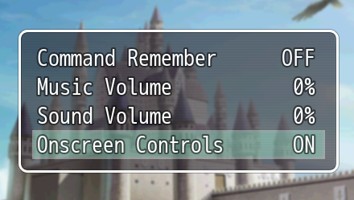
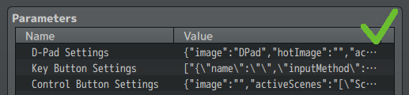
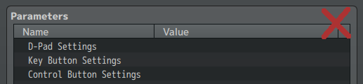
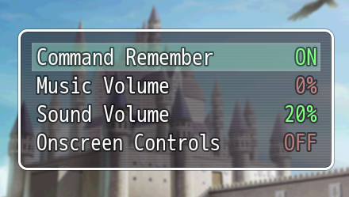

# RPG Maker MV Plugins

- **ALOE_VirtualButtons_Addon.js**:  Addon for [Virtual Buttons and DPad](https://aloeguvner.github.io/plugins/) by Aloe Guvner. Adds the option to enable/disable Virtual Buttons. Also has the ability to disable two-finger touch/RMB while Virtual Buttons are visible.  **Important: All buttons it the  ALOE_VirtualButtons.js plugin must be defined!**   

- **YAN_CustomizeOptions.js**: This plugin allows you to disable certain standard options in the options menu (e.g., "Always Dash," "Command Remember," etc.).

- **YAN_HideInactiveCursor.js**: Hides the mouse cursor if it remains inactive for a specified time interval.

-  **YAN_Mixed_Edits.js**: Various small edits to the core files. With this plugin, you can:
    - Disable filtering (good for crisp pixel art).
    - Change the Base Window opacity.
    - Adjust the Options Window width.
    - Disable the white flash at the start of encounters.
    - Make the values in the Options Menu colorful.  
    - Hide the Help Window
    - Change the alignment of the text in the Command Window

- **YAN_NoAccidentalDialogSkip.js**: By default, if you press the mouse button or touch the screen while a message is appearing, it will be skipped (this does not happen with keyboard input). This plugin fixes this issue.

- **YAN_SavefileList_Remake.js**: Slightly changes the look of the Save/Load scene and allows you to set the number of save slots.

- **YAN_SetRenderer.js**: Allows you to set the renderer separately for mobile and desktop.

- **YAN_SimpleNameInput.js**: Provides a simpler Name Input Window with support for only basic Latin characters and one fewer line (taking up less vertical space).

- **YAN_Simpler_Sound_Control.js**: Reduces the volume options from four to two: BGM Volume and ME Volume are combined into Music Volume, while BGS Volume and SE Volume are combined into Sound Volume.

- **YAN_SingleClickCommands.js**: Executes menu commands with the first mouse click or touch without requiring selection first (note: may be buggy on mobile).

- **YAN_TurnSwitchesOnStart.js**: Turns on selected switches at the start of the game.

- **YAN_WASD_Controls+.js**: Redefines the key mappings and adds a few new keys for use (more information inside the JS file).
